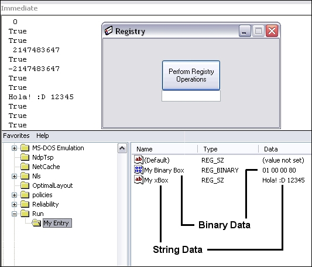



## Super Easy Powerful Registry API Functions

### Description

This Code allows you perform most of the common API Registry functions you might need.

Supporting String & Binary Values, but still, it is very easy to use and it will teach you alot about registry programming if you are new with this.

If you already have the knowlege, you will see how useful this is :)

Comon i'm not sayin anything more, just check it out, Post your FeedBacks & Vote 4 me :)

Please Rate it ok ? Thanx :)
 
### More Info
 
You might want to Add Values to some Registry Key right? you can Add both String & Binary Values!

If you do not already know, Registry Keys are Opened or Created before Adding Values. This is performed to obtain a Handle for the desired Key (a handle is a unique integer identifying an object and is set by MS Windows OS)

Returns Status Info

like Success, Failure or Other.

None that I know of! :)

             |
---                |---
**Submitted On**   |2002-05-31 12:17:20
**By**             |[Waleed A\. Aly](https://github.com/Planet-Source-Code/PSCIndex/blob/master/ByAuthor/waleed-a-aly.md)
**Level**          |Intermediate
**User Rating**    |5.0 (10 globes from 2 users)
**Compatibility**  |VB 5\.0, VB 6\.0
**Category**       |[Registry](https://github.com/Planet-Source-Code/PSCIndex/blob/master/ByCategory/registry__1-36.md)
**World**          |[Visual Basic](https://github.com/Planet-Source-Code/PSCIndex/blob/master/ByWorld/visual-basic.md)
**Archive File**   |[Super\_Easy886875312002\.zip](https://github.com/Planet-Source-Code/waleed-a-aly-super-easy-powerful-registry-api-functions__1-35316/archive/master.zip)

